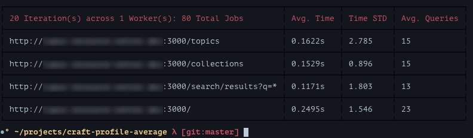

# craft-profile [WIP]

Have you found yourself working on a Craft site and constantly opening up devtools to look at Craft's Template Profiling output (Execution Time & Total Queries)? Have you ever wanted to know what the _average_ execution time is over a number of requests? Do you really want to do all that yourself, manually?

Enter `craft-profile`: a command-line tool for gathering Craft CMS Profiling data and reporting averages.

This tool is a **work in progress**. Expect instability and bugs. I plan to release this on NPM when I have time to add tests. If you'd like to try this tool out, great! I would appreciate any and all feedback - don't hesitate to open an issue.

See `TODO.md` for notes about progress and future features.

### Requirements

**Important**: In order for this script to work, your Craft site must have `devMode` on (so that Craft's Template Profiling data is injected into pages).

* Node >=5.4
* NPM >= 3.3.12

### Installation / Setup

Clone the repository and `cd` into the root directory.

Install dependencies from `npm`:
    
    $ npm install

Ensure the files in `/bin` are executable:

    $ chmod a+x bin/craft-profile
    $ chmod a+x bin/worker

OPTIONAL: Add the bin folder location to your $PATH, to allow execution of `craft-profile` without typing out the full location to the binary.

Reference the `config.json.example` for creating your own project's `craft-profile` config file. Alternatively, you may just use the command-line options.

### Usage

The basic premise is you provide `craft-profile` with a `baseUrl` and a list of `paths` to visit (URLs are created by appending each `path` to the `baseUrl`) along with a few other parameters. `craft-profile` handles issuing all of the requests, parsing out the profile data, and then aggregating, averaging, and reporting the results.

By default `craft-profile` will print a nicely formatted table to `stdout`.

    $ ./bin/craft-profile -c config.json

    $ ./bin/craft-profile -b http://mysite.dev:3000 \
                         -p /,/foo,/bar,/baz/qux \
                         -i 20

    $ ./bin/craft-profile --base-url=http://localhost:3000 \
                          --paths=/,/foo,/bar,/baz/qux
                          --iterations=20

### Options/Flags:

|short|long|description|
|---|---|---|
-b|--baseUrl|Base URL that paths will be appended to
-p|--paths|Comma-separated list of paths, e.g. "/,/foo,/bar/baz"
-i|--iterations|How many times to load each page
-w|--workers|How much concurrency (how many workers)
-t|--timeout|How long to wait before bailing on a request
-d|--delay|How long to wait before initiating subsequent requests
-o|--output|File to write output to, if not specified the program output will be displayed in the terminal
-c|--config|Relative path to JSON config file (will override the above flags)
 |--verbose|Output additional information while running

This program also accepts a JSON config file on stdin and will output to the specified file if the program's output is redirected.
